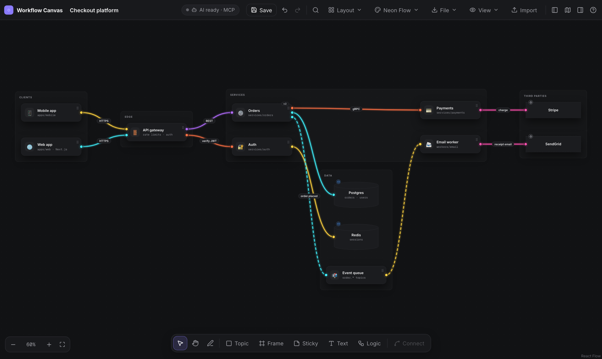
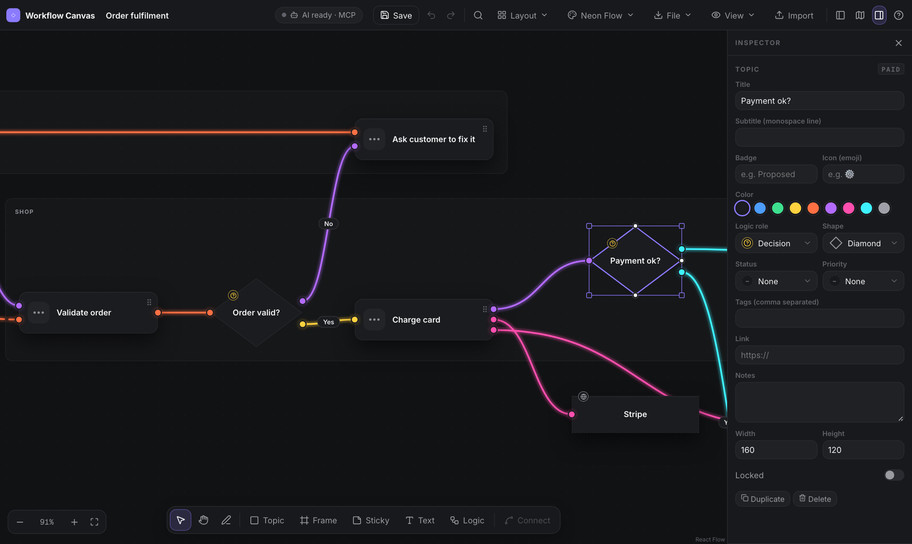
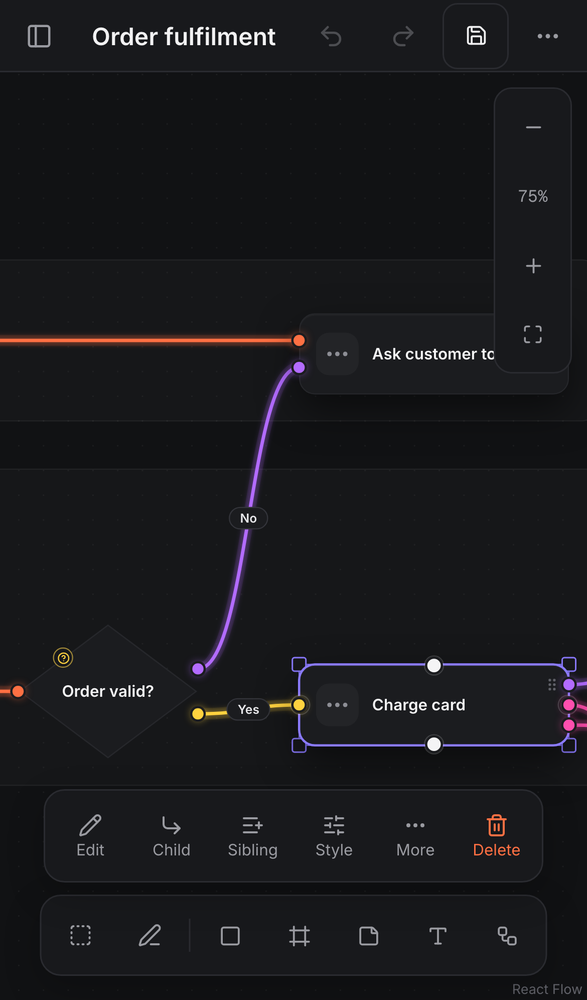
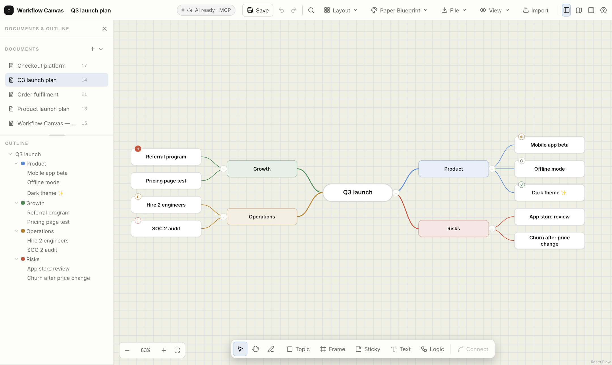
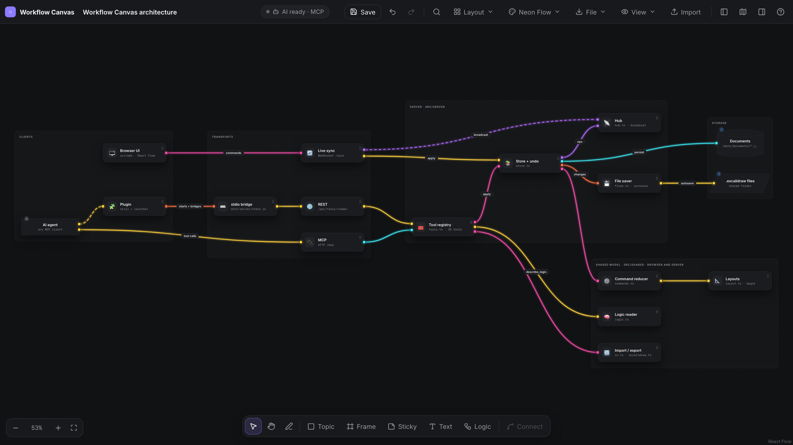

# Workflow Canvas

**An infinite canvas for plans, architectures, workflows, codebase maps and mind maps that you and your AI coding agent edit together, live.**

Workflow Canvas combines XMind-style mind mapping with free-form diagramming (cards, shapes, frames, stickies, freehand ink) and gives AI agents a complete MCP toolset: everything you can do in the UI, an agent can do through tools, in the same document, with shared undo. Diagrams can also carry *logic* (starts, decisions, ends, lanes, data stores) so an agent can read a flow back and implement it or write requirements from it.



- **Built for human + AI collaboration.** 36 MCP tools mirror the UI, from adding a node to switching themes. Changes stream live to every open tab with an activity feed; undo/redo is shared.
- **Diagrams an agent can understand.** Logic roles plus `describe_logic` turn a drawing into a numbered flow with branch conditions, loops, owners and data access, and list the gaps.
- **A plugin for Codex and GitHub Copilot CLI.** It bundles the MCP server and a skill that teaches the agent when and how to use the canvas, and it starts the canvas for you if it is not running.
- **Mind maps and diagrams in one place.** Tab/Enter mind-mapping, auto-arranged branches, swimlanes, dagre layouts, Markdown and emoji everywhere.
- **Excalidraw-compatible files.** Save to `.excalidraw` with autosave; files round-trip losslessly and open in Excalidraw.
- **Ten swappable themes**, including hand-drawn Excalidraw-style sketch themes and the neon node-graph look shown above.
- **Works on phones and tablets**, with 44px touch targets, drawers and bottom sheets.
- **Runs in Docker**, locally, with no account and no cloud.

## Quick start

Requirements: Docker (Docker Desktop on macOS or Windows).

```bash
git clone https://github.com/paguilar1227/workflow-canvas.git
cd workflow-canvas
docker compose up -d --build
open http://localhost:8790      # or visit it in any browser
```

Documents live in the `workflow-canvas-data` Docker volume. Change the port with `WFC_PORT=9000 docker compose up -d`. The app only listens on this machine by default; see [Security](#security) before exposing it.

## Use it with your AI agent

### Plugin for Codex and GitHub Copilot CLI (recommended)

[`plugins/workflow-canvas`](plugins/workflow-canvas) bundles the MCP server and the `workflow-canvas` skill. Its server launcher checks the canvas, starts Docker Desktop and the canvas container if needed, then connects, so the tools work even when the canvas was down.

```bash
# Codex
codex plugin marketplace add paguilar1227/workflow-canvas
codex plugin add workflow-canvas@workflow-canvas-plugins        # then restart Codex

# GitHub Copilot CLI
copilot plugin marketplace add paguilar1227/workflow-canvas
copilot plugin install workflow-canvas@workflow-canvas-plugins
```

A local checkout path works in place of `paguilar1227/workflow-canvas`. The launcher reads `WFC_URL` (default `http://localhost:8790`), `WFC_CONTAINER` (default `workflow-canvas`) and `WFC_REPO` (a checkout to `docker compose up` when no container exists yet).

### The skill

[`plugins/workflow-canvas/skills/workflow-canvas`](plugins/workflow-canvas/skills/workflow-canvas/SKILL.md) teaches an agent to use the canvas well: when a canvas beats prose, building a diagram in one undoable call, encoding flows with logic roles and labelled decisions, reading a diagram with `describe_logic` before implementing it, saving files, and what to do when the canvas is not running. [`references/recipes.md`](plugins/workflow-canvas/skills/workflow-canvas/references/recipes.md) has recipes for architecture maps, codebase maps, decision flows, mind maps, roadmaps and editing someone else's diagram.

To use the skill without the plugin, copy that folder into your agent's skills directory (for example `~/.claude/skills/` for Claude Code or `~/.codex/skills/` for Codex) and connect the MCP server as below.

### Any MCP client

| Transport | How |
| --- | --- |
| Streamable HTTP | `http://localhost:8790/mcp`, e.g. `claude mcp add --transport http workflow-canvas http://localhost:8790/mcp` or `codex mcp add workflow-canvas --url http://localhost:8790/mcp` |
| stdio | `docker exec -i -e WFC_PUBLIC_URL=http://localhost:8790 workflow-canvas node dist/server/stdio.js` (Claude Desktop and other stdio-only clients; `WFC_PUBLIC_URL` is the address people open, used for document links) |
| Plain HTTP | `GET /api/tools` (JSON Schemas), `POST /api/tools/<name>` with JSON arguments, `GET /api/documents/<id>?format=markdown\|mermaid` |
| Script | `node scripts/mcp-call.mjs list` or `node scripts/mcp-call.mjs call <tool> '<json>' [--save shot.png]` |

<details>
<summary>All 36 tools, and how they map to the UI</summary>

`get_canvas_state`, `list_documents`, `get_document`, `describe_logic`, `find_nodes`, `create_document`, `open_document`, `update_document`, `duplicate_document`, `delete_document`, `add_nodes`, `update_nodes`, `delete_nodes`, `move_nodes`, `duplicate_nodes`, `reparent_node`, `set_collapsed`, `add_edges`, `update_edges`, `delete_edges`, `create_diagram`, `auto_layout`, `align_nodes`, `distribute_nodes`, `fit_frame_to_contents`, `import_content`, `export_document`, `capture_screenshot`, `undo`, `redo`, `select`, `control_view`, `list_themes`, `set_theme`, `set_ui`, `save_to_file`.

| Human action in the UI | AI tool |
| --- | --- |
| New / rename / duplicate / delete / switch documents | `create_document`, `update_document`, `duplicate_document`, `delete_document`, `open_document` |
| Add topic, sticky, text, frame, pen stroke; Tab / Enter | `add_nodes` (kinds topic/frame/sticky/text/drawing, `parentId` for branches) |
| Edit any field in the inspector, resize, lock | `update_nodes` |
| Drag nodes / frames (members follow) | `move_nodes` (`includeContents`) |
| Duplicate / copy-paste | `duplicate_nodes` |
| Drop a topic on another (re-parent) | `reparent_node` |
| Collapse / expand branches | `set_collapsed` |
| Connect, label, style, reverse, delete connectors | `add_edges`, `update_edges`, `delete_edges` |
| Delete | `delete_nodes` |
| Layout menu, align / distribute, fit frame | `auto_layout`, `align_nodes`, `distribute_nodes`, `fit_frame_to_contents` |
| Mind-map structure & auto-arrange settings | `update_document` (`treeLayout`, `autoArrange`) |
| Import / export menus | `import_content`, `export_document` |
| Undo / redo | `undo`, `redo` (shared history) |
| Select / multi-select | `select` (and read the human's selection via `get_canvas_state`) |
| Zoom, pan, fit, focus | `control_view` |
| Theme picker | `list_themes`, `set_theme` |
| Save / autosave to a .excalidraw file | `save_to_file` with `path` (a file or a folder; autosaves from then on) |
| Panels, minimap, snap, background, search, pen/hand/select tool, zen, view-only, start inline editing | `set_ui` |
| Logic menu, Logic role picker, decision Yes/No labels | `add_nodes` / `update_nodes` (`role`), `add_edges` (`label`) |
| File → Logic description | `describe_logic` (or `export_document` format `logic`) |
| Look at the canvas | `capture_screenshot`, `get_document`, `find_nodes` |

Bulk drawing: `create_diagram` adds nodes and edges and arranges them in one undoable step.

</details>

## Logic: diagrams people and AI can both read



A topic can carry a **logic role**, so the diagram says what it means and not just how it looks. Pick one from **Logic** in the toolbar (a bottom sheet on phones) or the Inspector's **Logic role** picker; **D** adds a decision.

| Role | Meaning | Default look |
| --- | --- | --- |
| Start | Entry point or trigger | pill |
| End | Outcome where the flow stops | pill, heavy outline |
| Decision | Yes/no or multi-way choice | diamond; new connectors from it are labelled Yes, then No |
| Parallel | Split into paths that run at once, or join them | hexagon |
| Wait | Timer, event or message | circle |
| Data | Input or output (form, message, file, report) | parallelogram |
| Data store | Database the flow reads or writes | cylinder |
| Subprocess | Flow detailed elsewhere (link its document) | rounded, double outline |
| External | Person, team or outside system | rectangle, dashed outline |

A topic with no role is an ordinary step. Frames act as lanes (who owns a step), stickies connected to a step are notes on it, and loose stickies are open notes.

**File → Logic description** and the AI tool `describe_logic` turn the canvas into a written flow:

```text
4. **Order valid?** · decision · lane: Shop
   Depending on the answer:
   - **Yes** →
     5. **Charge card** · step · lane: Shop
        - writes **Orders DB**
        - sends to **Stripe**
     ...
   - **No** →
     14. **Ask customer to fix it** · step · lane: Customer
        → loops back to step 2 (**Order form**)

## Issues
- The branch from decision **Payment ok?** to **Order cancelled** has no condition label.
```

It lists numbered steps from each start, every decision's conditions and where they lead, loops, merges, parallel splits and joins, lanes, data stores read and written, external actors and notes. The **Issues** list covers the gaps: unlabelled branches, dead ends, steps no start reaches, loops with no exit and a missing start. That is what an agent reads before it implements a design or drafts requirements from it.

## Features

| Area | Features |
| --- | --- |
| Canvas | Infinite pan/zoom (scroll, ⌘+scroll / pinch, Space+drag, hand tool), fit view, minimap, dot/line/cross grid, snap to grid |
| Mind maps (XMind-style) | Tab = child, Enter = sibling, F2 edit, `/` collapse/expand with counts, arrow-key navigation, drag a topic onto another to re-parent, auto-arranged branches, layouts: balanced mind map, logic chart →/←, org chart ↓ |
| Diagrams | Cards (icon + title + monospace subtitle + badge), rounded/pill/rectangle/diamond/circle/hexagon/cylinder/parallelogram shapes, logic roles (below), stickies, free text, frames/swimlanes (members move with the frame), connectors via handle drag (drop anywhere on the target), labels, arrows, solid/dashed/dotted, smooth/bezier/straight/step routing, animated flow |
| Excalidraw-inspired | Freehand pen (P), hand-drawn "Excalidraw Sketch" themes in light and dark (rough.js), R/D/O shortcuts (rectangle, decision, ellipse), zen mode (Alt+Z), view-only mode (Alt+R), copy PNG to clipboard, `.excalidraw` import/export |
| Editing | Inspector for every property (title, subtitle, badge, emoji icon, color, shape, status, priority, tags, link, notes, size, lock; shape, status and priority are compact pickers that open as bottom sheets on phones), multi-select align/distribute/frame/connect, copy/cut/paste/duplicate, context menus, undo/redo (shared with AI) |
| Layout | Graph (dagre) LR/TB with frames as clusters, swimlanes, grid, tree layouts |
| Documents | Multiple canvases from templates (blank, mind map, architecture lanes, workflow), rename, duplicate, delete, outline panel, search (⌘F). Drag the bar between Documents and Outline (or focus it and use the arrow keys) to resize the list; double-click or Enter resets it, and the size is remembered on each device |
| Import / export | Import Mermaid flowcharts (subgraphs → frames), Markdown outlines (→ mind map), Excalidraw scenes, JSON. Export PNG, SVG, Markdown, the logic description, Mermaid, Excalidraw, JSON |
| Collaboration | Every open tab and every AI client sees changes live; AI edits show an activity feed and highlight the touched nodes |

Press **?** in the app for the full shortcut list.

## Markdown and emoji

- **Sticky notes and text** render GitHub-flavoured Markdown: headings, **bold**, *italic*, ~~strike~~, `code`, code blocks, lists, tables, quotes, links, and task lists. Click a `- [ ]` checkbox on the canvas to tick it (on a touch screen you can also select the note, then tap the task's words); the source line flips to `- [x]`. Editing shows the raw Markdown.
- **Topic and frame titles, connector labels and outline rows** render inline Markdown (bold, italic, code, strike, links).
- **Emoji in every text field.** Type `:rocket:` and it becomes 🚀 as you type the closing colon; type `:ro` for suggestions (↑↓, Enter/Tab, Esc), or use the ☺ button docked above the field for a searchable picker (a bottom sheet with 44px targets on touch screens). Shortcodes are GitHub's names.
- **AI parity.** The server converts `:shortcodes:` in every write (UI or MCP), so agents can write `:white_check_mark: Ship it` and Markdown task lists and the person sees the same result. Raw HTML is shown as text and `javascript:` links are dropped.

## Saving to a file

Press **Save** (⌘S) to pick where to save the drawing in the Finder save dialog. From then on every change, including AI edits, is autosaved to that `.excalidraw` file. **File → Open** (⌘O) loads a `.excalidraw` file and keeps autosaving to it; **Save as** (⇧⌘S) picks a new file. Files are standard Excalidraw scenes, so they open in Excalidraw too; Workflow Canvas stores everything Excalidraw has no native field for (mind-map structure, collapse state, statuses, connector routing, document settings) in Excalidraw's `customData`, so reopening a saved file in Workflow Canvas is lossless. Saving to disk uses the browser's File System Access API (Chrome, Edge and other Chromium browsers); after a reload one click on **Resume autosave** re-grants access. In other browsers Save downloads a copy instead. Documents are also kept on the server as before.

**AI sessions save without a click.** An agent calls `save_to_file` with a `path`: a `.excalidraw` file, or a folder such as its working or artifacts folder (the file is named after the document). The server writes it and autosaves it after every change, by the AI or a person, and keeps doing so after a restart. Later calls without `path` save to the attached file. It never replaces an existing file unless the agent passes `overwrite: true`. Docker Compose shares `~/Documents` into the container at the same path, so host paths work as-is; set `WFC_SAVE_ROOT=/some/folder` to share a different folder (see [Security](#security)). When the server cannot reach the path (outside the shared folder, or a hosted preview with no shared folder), nothing is written and the response carries the file contents for the agent to write itself; that copy is not autosaved.

## Phones and tablets



When the screen is too narrow for both side columns and the toolbar (phones, portrait tablets, landscape phones, and mouse-driven windows under 1198px) the outline and inspector become drawers that slide over the canvas. Open the outline with ☰ and the inspector with **Style** or **More → Inspector**. Each drawer expands to full width or closes from its own header, and tapping outside closes it. Everything else in the top bar moves into one **More** sheet.

Touch works like other mobile whiteboards:

| Do this | Gesture |
| --- | --- |
| Pan / zoom | Drag empty canvas / pinch |
| Select several nodes | **Area** tool, then drag |
| Edit, add child or sibling, style, delete | Action bar shown while something is selected |
| Context menu | Long-press (opens as a bottom sheet) |
| Add a topic, sticky, text, frame or logic node | Toolbar button, then tap where it should go |

On touch screens every control is at least 44×44px (WCAG 2.5.5, Apple HIG) and text fields use 16px type so iOS does not zoom when you type. Drawer state is per device; the AI's panel tools still control the docked columns on desktop. Mobile browsers have no File System Access API, so **Save** downloads a copy there.

<br clear="right">

## Themes



Themes are sets of CSS variables that people and AI can swap at runtime (`set_theme`). Several directions were researched with [Refero](https://refero.design) and adapted rather than copied; the products named below inspired a look and are not affiliated with this project.

| Theme | Mode | Inspired by |
| --- | --- | --- |
| Neon Flow (default) | dark | [Omer Assa's node-connector demo](https://x.com/omer_assa/status/2106758938926391416) |
| Lens Dark | dark | A dark code-mapping diagram style |
| Warp Graphite | dark | Warp |
| Paper Blueprint | light | Paper |
| Whimsical Studio | light | Whimsical |
| Modal Terminal | dark | Modal |
| Nornorm Ink | light | Nornorm |
| Hyperstudio Amber | dark | Hyperstudio |
| Excalidraw Sketch | light | Excalidraw, drawn with rough.js |
| Excalidraw Sketch Dark | dark | Excalidraw's dark mode, drawn with rough.js |

**Neon Flow** is a node-graph look: charcoal cards with a grip and port dots, thick neon bezier wires with a soft glow (connectors without a colour get one of yellow, pink, purple, orange or cyan from the pair they join). While you drag a connector the wire is white; near a port it snaps with an electric spark and a ring in the colour the wire will take, and when it lands the wire flashes from white to its colour while light sweeps around the card from that port. Connectors added by an AI or by undo play the same animation. Wires that share a side of a card each get their own port, spaced evenly and ordered so they don’t cross. In this theme “smooth” routing draws as a bezier curve and ends show port dots instead of arrowheads. Motion is skipped when the system asks for reduced motion.

Fonts are bundled open-source families (Inter, Manrope, Space Grotesk, Fraunces, JetBrains Mono, Geist Mono, Patrick Hand).

## Configuration

| Variable | Default | What it does |
| --- | --- | --- |
| `WFC_PORT` | `8790` | Host port (Docker Compose) |
| `WFC_BIND` | `127.0.0.1` | Host address to listen on (Docker Compose); `0.0.0.0` exposes it to your network |
| `WFC_ALLOWED_HOSTS` | none | Extra host names the server accepts (comma separated), e.g. your machine's LAN name for a phone |
| `WFC_SAVE_ROOT` | `~/Documents` | Host folder shared into the container so `save_to_file` can write there |
| `DATA_DIR` | `/data` in Docker | Where documents are stored (`documents/*.json`; deleted ones move to `trash/`) |
| `WFC_URL`, `WFC_CONTAINER`, `WFC_REPO` | see above | Plugin launcher settings |
| `WFC_PUBLIC_URL` | none | stdio bridge: the canvas address people open, reported as `canvasUrl` for links |

## Security

Workflow Canvas has **no login**. Anyone who can reach the server can read and edit every document and use every tool, including `save_to_file`, which writes into the shared folder.

- By default it listens only on `127.0.0.1` and rejects requests whose `Host` is not a known local name (against DNS rebinding) and browser requests from other origins (against other websites driving the tools).
- To use it from a phone on your network: `WFC_BIND=0.0.0.0 WFC_ALLOWED_HOSTS=192.168.1.20,my-mac.local docker compose up -d`. Only do this on a network you trust.
- Docker Compose shares `~/Documents` (or `WFC_SAVE_ROOT`) into the container read-write, so agents can autosave `.excalidraw` files there. Point `WFC_SAVE_ROOT` at a dedicated folder to narrow that.
- **Gateway mode.** Setting `DEMO_DEPLOYMENT_ID` tells the server it runs behind an authenticating reverse proxy that already enforces sign-in and same-origin requests: it turns off the host and origin checks, trusts `X-Forwarded-*` headers and reports the deployment (and `DEMO_DEPLOY_SOURCE_SHA`) on `/health`. The author uses it for preview deployments. Leave it unset unless your proxy enforces all of that. Readiness probes for such deployments are always available: `/deployment`, a WebSocket echo on `/ws`, and, with `DATABASE_URL` set, `POST /db-marker` (a Postgres write/read check).

## Development

```bash
npm install
npm run dev          # server + Vite on http://localhost:8790 (data in ./data)
npm run typecheck
npm run build && npm start
```



`src/shared` holds the document model, the deterministic command reducer (`commands.ts`), layouts, themes, import/export and the logic reader (`logic.ts`); the browser and the server use the same code. The server (`src/server`) stores documents, keeps undo history as structural diffs, broadcasts operations over WebSocket and exposes the tool registry over MCP and REST. The UI (`src/web`) is React + React Flow and dispatches the same commands optimistically.

## Testing

User-perspective tests are the main suite. The browser and AI suites create and delete documents and switch themes, so run them against a throwaway container, not the canvas you use:

```bash
docker run -d --name wfc-test -p 127.0.0.1:8792:8790 workflow-canvas:latest
```

| Suite | Command |
| --- | --- |
| Human journeys on desktop and phone (Playwright, with video) | `npx playwright test` (uses `BASE_URL`, default `http://localhost:8792`) |
| AI agents working the canvas (real `codex exec` agents over MCP) | `node scripts/ai-tests/run.mjs --base http://localhost:8792 --container wfc-test` (flags and the second, no-shared-folder container are described at the top of the script) |
| Skill evals (Codex and Copilot agents using the plugin) | start `wfc-skill-eval` on 8797 and `wfc-skill-eval-codex` on 8798 the same way, then `node scripts/skill-evals/run.mjs --repo <small git repo to map> --out <dir>`; rubric notes in [`RUBRIC-CHANGES.md`](scripts/skill-evals/RUBRIC-CHANGES.md) |
| Logic reader and layout | `npm run test:unit` |
| Plugin launcher (stubbed Docker) | `npm run test:plugin` |

The AI suites need the Codex or Copilot CLI and spend model credits. The skill evals run the agents with your own CLI configuration, so your other skills and instructions take part.

## Known limitations

- `capture_screenshot` and PNG/SVG export render in a connected browser tab; with no tab open the tool returns an error that says so.
- Undo history is kept in server memory and resets when the container restarts; documents persist.
- Saving straight to disk uses the File System Access API (Chromium browsers); other browsers download a copy.

## License and credits

[MIT](LICENSE). Built with [React Flow](https://reactflow.dev), [rough.js](https://roughjs.com), [dagre](https://github.com/dagrejs/dagre), the [Model Context Protocol SDK](https://github.com/modelcontextprotocol/typescript-sdk) and [markdown-it](https://github.com/markdown-it/markdown-it), and inspired by [Excalidraw](https://excalidraw.com) and [XMind](https://xmind.com).
